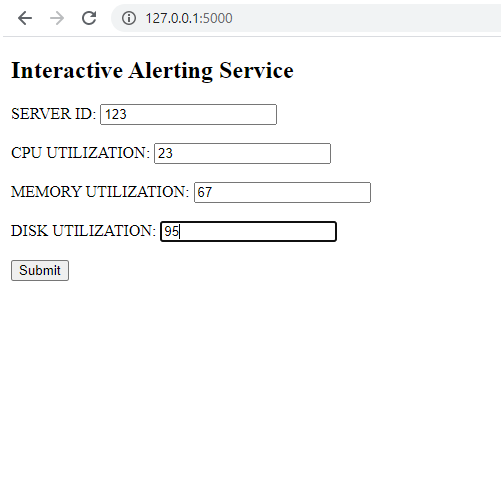
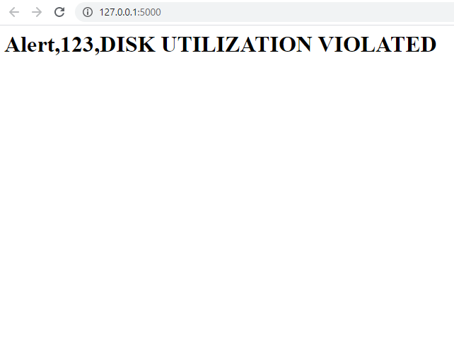

# Alerting Service 

app.py is the root file which contains class named Alert.Driver functions carries all logical operations for desired output.

### Form where you need to fill details

### Result

